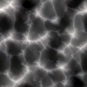

# NCA Heightmap Generator

A **Neural Cellular Automata (NCA)** based heightmap generator that learns to produce realistic and varied terrain heightmaps through iterative cellular updates.

  
*Example heightmap generated by A traditional model*

  
*Example heightmap generated by the NCA model*

---

## Features

- Generates heightmaps using a learned NCA model
- Supports customizable iterations for refinement
- Stable and repeatable terrain pattern generation
- Easy to extend for different terrain types or additional features
- Implemented in Python with PyTorch

---

## Getting Started

### Requirements

- Python 3.9+
- PyTorch
- NumPy
- Matplotlib (for visualization)
- Trimesh

Install dependencies using:

```bash
pip install -r requirements.txt
```

---

### Generate Ground Truth

You can generate a terrain heightmap using a classical erosion algorithm by running:

```bash
python erosion.py --noise fbm --outfile ./maps/fbm_terrain.png --dim 512
```

---

### Training

Once the ground truth is generated, you can train a new NCA model with:

```bash
python train.py --style_img_path fbm_noise.png --resolution 128 --type NCA --lr 0.001 --epochs 2000 --use_chunks --save_path ./my_ca_model.pt
```

---

### Running Pretrained Models

This repository includes example usage of pretrained models.

To generate a new heightmap using a pretrained model, run:

```bash
python generate_heightmap.py --grid_size 2 --method "Chunk FBM" --res 128 --num_steps 20 --steps 5 --seed_size 32
```

---

### Exporting and Visualizing

For better interactivity and usability, a script is provided to export the generated heightmap as a 3D mesh and visualize it.

> **Note:** The mesh color might not carry over to tools like Blender.

You can export and visualize the mesh using:

```bash
python generate_3D_mesh.py --image output.png --resolution 256 256 --pixel_scale 40.0 --height_scale 10.0 --output mesh.obj --visualize
```

---

## Acknowledgements

- Inspired by works on Neural Cellular Automata by Google Research
- Terrain generation ideas based on procedural erosion techniques

---

## Contact

For questions or contributions, feel free to open an issue or submit a pull request.
